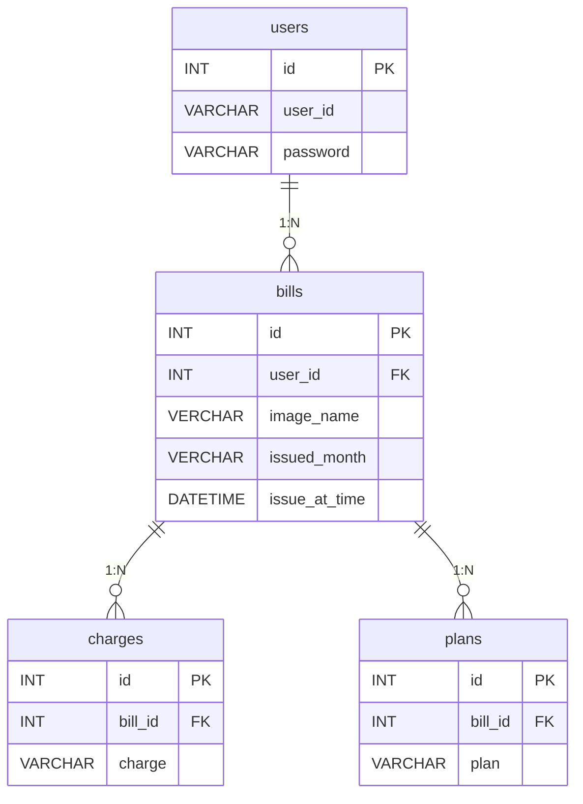

```mermaid
erDiagram
    users ||--o{ bills:"1:N"
    bills ||--o{ charges:"1:N"
    bills ||--o{ plans:"1:N"

    users {
        INT id PK
        VARCHAR user_id 
        VARCHAR password
    }

    bills {
        INT id PK
        INT user_id FK
        VERCHAR image_name
        VERCHAR issued_month
        DATETIME issue_at_time
    }

    plans {
      INT id PK
      INT bill_id FK
      VARCHAR plan  
    }

    charges {
      INT id PK
      INT bill_id FK
      VARCHAR charge  
    }

```

